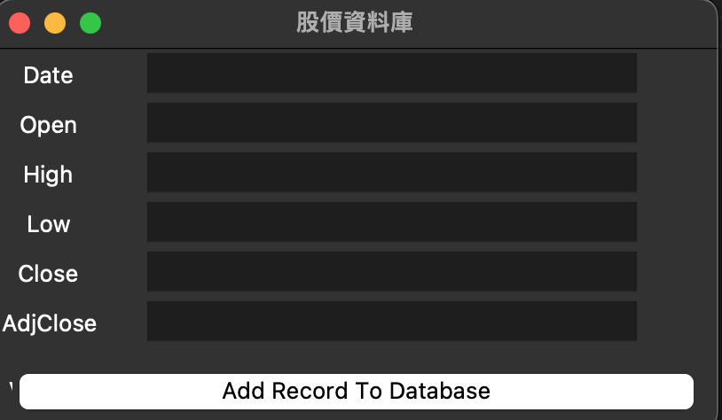

# stock SQLite GUI Tkinter 
The stock SQLite GUI application could store the data.

# Create SQL database and convert to a CSV file
Follow the following tutorial to create SQLite database and then export data to a csv file.
Export SQL Tables To Excel with Python (NeuralNine) 
https://www.youtube.com/watch?v=m9cFBVLDB2c 

# Convert an Apple Healthkit export zip to a PostgreSQL database
[jupyter notebook](./healthkit_to_postgresql.ipynb)  
[code](./healthkit_to_postgresql.py)
